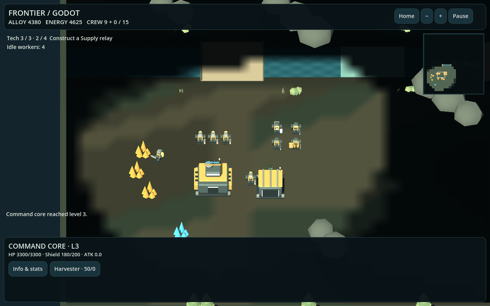

# Frontier Command · Godot + Blender

An original 3D single-player RTS built in **Godot 4.7.2 / GDScript**, with original Blender 4.5.3 assets and animation. This repository is independent of the [Three.js edition](https://github.com/buicongnguyen/3d_astra).

[Play the Godot web edition](https://buicongnguyen.github.io/3d_astra_godot/) · [Original plan](GODOT_BLENDER_PLAN.md) · [Executed improvements](IMPROVEMENT_PLAN.md) · [Review and verification](REVIEW_AND_VERIFICATION.md)



## Play

Choose Meridian Riverlands or Ashen Frontier, customize army colors if desired, and deploy. Assign Harvesters to alloy and energy, build supply, train a mixed army, then destroy the enemy Command core.

- Desktop: click/drag selection, right-click orders, WASD/arrows to pan, wheel or +/− to zoom, middle drag to pan. Q attack-move, X stop, H home, F focus selection. Shift queues orders. Shift + 1–9 assigns groups; 1–9 recalls. Ctrl + number also works in the native build where the OS does not intercept it.
- Touch: tap friendly entities to select; tap a resource/enemy/ground to issue a contextual order. Drag pans; pinch zooms. Use Move/Attack-move buttons for explicit orders. Construction uses a ground tap followed by Confirm site.
- Buildings: select to train units, cancel queued production, or cancel an unfinished site for a 75% refund. Right-click ground sets a rally point.
- Info & stats: select any unit or building to read its function, costs and combat stats. The roster has six units: Harvester, Vanguard, Ranger, Breaker, Medic and Engineer. Medics heal infantry; Engineers repair completed buildings and Breakers. Use Support → friendly target, or keep them near injured allies for automatic support.
- Technology: upgrade the Command core, then other buildings, through three levels. Level 2 Barracks unlocks Medics; level 2 Foundry unlocks Engineers. Level 3 strengthens the base and production. See the [progression plan and balance tables](PROGRESSION_PLAN.md) for exact costs and effects. Shields absorb damage before HP and regenerate after five seconds without damage.
- Settings: briefing or Pause → Army & graphics settings. Different army colors, Eco shadows, vegetation, water motion, and command sound mute are saved locally. Pause freezes gameplay and animated units; Settings retains the previous pause state.

## Run or edit

Install the standard **Godot 4.7.2** editor (GDScript; .NET is unnecessary) and open `project.godot`. Press F6/F5 or run:

```powershell
& $env:GODOT --path .
```

Use the same version as CI for reproducibility. Godot uses the Compatibility renderer on both native and web. Editable `.blend` files are under `assets/source/`; `.gdignore` prevents direct Blender import. The committed GLBs are the engine inputs, so Blender is needed for asset authoring rather than for playing or opening the game.

## Verify and export

```powershell
& $env:GODOT --headless --editor --path . --import
& $env:GODOT --headless --path . --script res://tests/simulation_test.gd
& $env:GODOT --headless --path . --script res://tests/progression_test.gd
& $env:GODOT --headless --path . --script res://tests/assets_test.gd
& $env:GODOT --headless --path . --export-release Web
& $env:GODOT --headless --path . --export-release Windows
npm ci
npx playwright install chromium
npm run serve
# In a second terminal:
npm run test:browser
```

Before exporting, place the matching official `web_nothreads_debug.zip`, `web_nothreads_release.zip`, `windows_debug_x86_64.exe`, and `windows_release_x86_64.exe` templates in `.tools/templates/`, and create `build/web/` and `build/windows/`. The CI workflow shows the reproducible download and checksum procedure. Standard editor-installed templates can also be used by clearing the custom-template paths in Export settings.

Open `http://127.0.0.1:4176/3d_astra_godot/`; web exports require HTTP(S), not file://. Set `TEST_URL` to test another host. The opt-in `?test=1` bridge exposes simulation fixtures for automated testing; ordinary play does not expose these helpers. Browser tests exercise the actual Godot canvas with mouse and touch input, with explicit simulation steps to avoid long real-time waits. Strategic AI is disabled in the UI fixtures and tested separately through complete matches.

The Windows output is `build/windows/FrontierCommand.exe`. CI also preserves it as the **FrontierCommand-Windows** artifact. Exported binaries, tools, caches, and node_modules are excluded from Git.

## Rebuild Blender assets

```powershell
& $env:BLENDER --background --python tools/blender/generate_assets.py
& $env:BLENDER --background --python tools/blender/generate_environment.py
& $env:BLENDER --background --python tools/blender/animate_units.py
```

One world unit is one meter. GLBs use Y-up and ground-centered origins. Team and TeamGlow material names identify paint regions. Six mechanical units have Idle, Walk, Work, Attack, and Death clips authored in Blender using rigid articulated parts. Godot plays these through AnimationPlayer. These are original assets, with no external model or animation downloads.

## Architecture and deployment

- `scripts/simulation.gd`: authoritative economy, commands, construction, production, combat, AI and visibility; independent of rendering.
- `scripts/navigation.gd`: radius-aware AStarGrid2D routes and swept obstacle/water checks.
- `scripts/world_view.gd`: Blender scene instances, team materials, animations, terrain, water and visual fog.
- `scripts/main.gd`: match flow, input, settings, HUD and optional test bridge.
- `scripts/overlay.gd`: minimap, last-known enemy structures, selection box and health information.
- `data/balance.json`: shared original definitions, costs and counters copied from the Three.js edition.

Push `main` over SSH to trigger `.github/workflows/pages.yml`. CI verifies official engine hashes, imports assets, runs logic/asset tests, exports native/web, then tests desktop/touch browser interactions before deploying Pages. The web preset is **single-threaded**, so it needs no cross-origin-isolation workaround. See [Godot's web export documentation](https://docs.godotengine.org/en/stable/tutorials/export/exporting_for_web.html).

This is a playable RTS prototype, not a commercial-scale replacement for Age of Empires or StarCraft. Physical Android/iOS testing, large-army batching, true elevation and deeper balance work remain follow-ups documented in the improvement plan.
